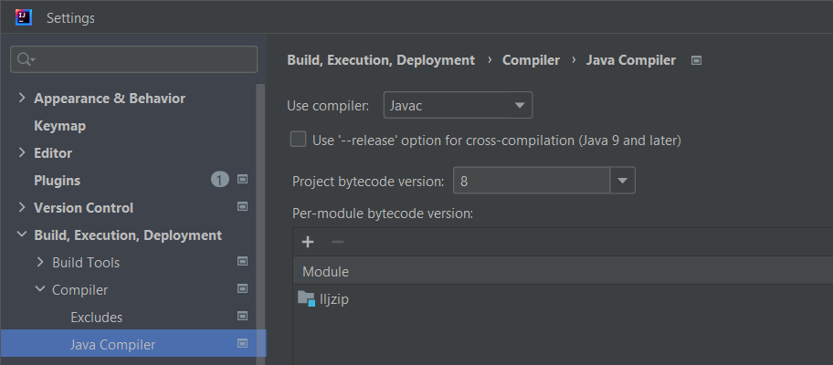

# LLJ-ZIP [](https://jitpack.io/#Col-E/LL-Java-Zip) 


A closer to the spec implementation of ZIP parsing for Java.

## Relevant ZIP information
 
**[Official spec](https://pkware.cachefly.net/webdocs/casestudies/APPNOTE.TXT)**

The notes and structure outlines are the basis for most of LLJ-ZIP.

**[JVM zip parsing](https://github.com/openjdk/jdk/tree/6701eba736ac51db4b0d0d7db6c7bdd4ae8a1c16/src/java.base/share/native/libzip) & [JLI](https://github.com/openjdk/jdk/blob/739769c8fc4b496f08a92225a12d07414537b6c0/src/java.base/share/native/libjli/parse_manifest.c#L120)**

The JVM zip reader implementation is based off this piece.

> This is a zip format reader for seekable files, **that tolerates leading and trailing garbage**, 
> and **tolerates having had internal offsets adjusted for leading garbage** _(as with Info-Zip's zip -A)_.

But that's not all it does. That's just what that one comment says. Some other fun quirks of the JVM zip parser:

- The end central directory entry is found by scanning from the end of the file, rather than from the beginning.
- The central directory values are authoritative. Names/values defined by the local file headers are ignored.
- The file data of local file headers is not size bound by the file header's compressed size field. Instead, it uses the central directory header's declared size.
- Class names are allowed to end in trailing `/` which most tools interpret as directories.

## Additional features

- Reads ZIP files using `Unsafe` backed mapped files.
    - Using `FileChannel.map` yields `MappedByteBuffer` which uses `int` values, limiting files up to about 2GB
    - Our `UnsafeMappedFile` implementation uses `long` which far exceeds the GB file size range
- Highly configurable, offering 3 ZIP reading strategies out of the box _(See `ZipIO` for convenience calls)_
    - Std / Forward scanning: Scans for `EndOfCentralDirectory` from the front of the file, like many other tools
    - Naive: Scans only for `LocalFileHeader` values from the front of the file, the fastest implementation, but obviously naive
    - JVM: Matches the behavior of the JVM's ZIP parser, including a number of odd edge cases. Useful for opening JAR files to mirror `java -jar <path>` behavior.
- Inputs do not have to be on-disk to be read, you can supply zip data in-memory.

## Usage

Maven dependency:
```xml
<dependency>
    <groupId>software.coley</groupId>
    <artifactId>lljzip</artifactId>
    <version>${zipVersion}</version> <!-- See release page for latest version -->
</dependency>
```

Gradle dependency:
```groovy
implementation group: 'software.coley', name: 'lljzip', version: zipVersion
implementation "software.coley:lljzip:${zipVersion}"
```

Basic usage:
```java
// ZipIO offers a number of different utility calls for using different ZipReader implementations
ZipArchive archive = ZipIO.readJvm(path);

// Local files have the actual file data/bytes.
// These entries mirror data also declared in central directory entries.
List<LocalFileHeader> localFiles = archive.getLocalFiles();
for (LocalFileHeader localFile : localFiles) {
    // Data model mirrors how a byte-buffer works.
    ByteData data = localFile.getFileData();
    
    // You can extract the data to raw byte[]
    byte[] decompressed = ZipCompressions.decompress(localFile);
    
    // Or do so with a specific decompressor implementation
    byte[] decompressed = localFile.decompress(DeflateDecompressor.INSTANCE);
}

// Typically used for authoritative definitions of properties.
// Some ZIP logic will ignore properties of 'LocalFileHeader' values and use these instead.
//  - Try using a hex editor to play around with this idea. Plenty of samples in the test cases to look at.
List<CentralDirectoryFileHeader> centralDirectories = archive.getCentralDirectories();

// Information about the archive and its contents.
EndOfCentralDirectory end = archive.getEnd();
```

For more detailed example usage see the [tests](src/test/java/software/coley/lljzip).

> How does each `ZipReader` implementation map to standard Java ZIP handling?

If you're looking to see which implementation models different ways of reading ZIP files in Java, here's a table for reference:

| Java closest equivalent | LL-Java-Zip                                        |
|-------------------------|----------------------------------------------------|
| `ZipFile`               | `JvmZipReader` / `ZipIO.readJvm(...)`              |
| `ZipInputSstream`       | `ForwardScanZipReader` / `ZipIO.readStandard(...)` |
| N/A                     | `NaiveLocalFileZipReader` / `ZipIO.readNaive(...)` |

There is also a `ZipFile` delegating reader `AdaptingZipReader` but it should primarily be used only for debugging purposes.

## Building

Due to some `sun.misc.Unsafe` hacks _(For performance and long addressing)_, you will get compiler warnings when first opening the project in IntelliJ.
You can resolve this by changing the compiler target:

